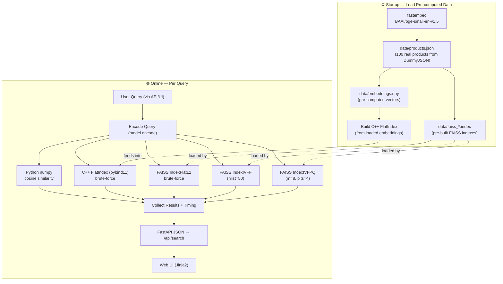
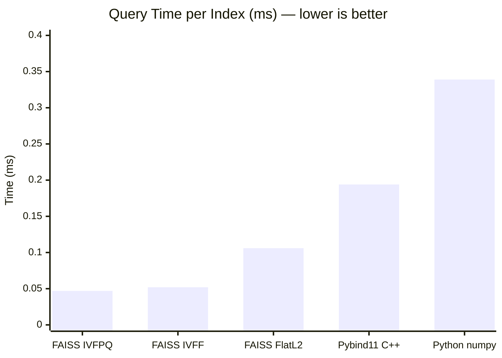

# SSE Benchmark -- Semantic Search Engine

A semantic search engine that benchmarks 5 indexing strategies against one another -- from Python numpy cosine similarity and a custom C++ FlatIndex, to FAISS FlatL2, IVFF, and IVFPQ indexes -- all served through a FastAPI web UI. Uses `BAAI/bge-small-en-v1.5` embeddings and a real 100-product catalog from [DummyJSON](https://dummyjson.com/).

---

## Pipeline



---

## Features

- **5 search strategies** compared per query -- C++ FlatIndex, FAISS FlatL2, FAISS IVFF, FAISS IVFPQ, and Python cosine similarity
- **Web UI** with side-by-side result comparison and ranked timing breakdown
- **REST API** -- single endpoint, structured JSON responses
- **Benchmarking built-in** -- every query measures and reports timing for each index
- **Real product catalog** -- 100 products fetched from [DummyJSON](https://dummyjson.com/)

---

## Architecture

```mermaid
flowchart TD
    SRC["src/"] --> MAIN["main.py — FastAPI server"]
    SRC --> SSE["sseClass.py — SemanticSearch orchestrator"]
    SRC --> TEMPLATES["templates/"]
    TEMPLATES --> HTML["index.html — Web UI (Jinja2)"]
    SRC --> COMPONENTS["components/"]
    COMPONENTS --> C1["build_model.py — fastembed loader"]
    COMPONENTS --> C2["embeddings.py — 5 search strategies + timing"]
    COMPONENTS --> C3["build_faiss_model.py — FAISS index builder (legacy)"]
    COMPONENTS --> C4["get_products.py — DummyJSON product fetcher"]
    COMPONENTS --> C5["input.py — CLI input handler"]
    COMPONENTS --> C6["print_res.py — CLI result printer"]
    COMPONENTS --> C7["visualize.py — Matplotlib scatter"]
    COMPONENTS --> C8["timing.py — (placeholder)"]
    SRC --> BIND["bindable_functions/"]
    BIND --> CPP["FlatIndex.cpp — C++ FlatIndex (pybind11)"]
    BIND --> EX["example.cpp — pybind11 example"]
    SRC --> DATA["data/"]
    DATA --> D1["products.json — 100 real products"]
    DATA --> D2["embeddings.npy — pre-computed vectors"]
    DATA --> D3["faiss_l2.index — FlatL2 index"]
    DATA --> D4["faiss_ivff.index — IVFF index"]
    DATA --> D5["faiss_ivfpq.index — IVFPQ index"]
    SRC --> SO["cos_sim.so — compiled C++ extension"]
    SRC --> SETUP["setup.py — C++ extension build"]
```



### Indexes

| Index | Type | Training | Speed | Accuracy |
|-------|------|----------|-------|----------|
| Python numpy | Flat (cosine sim) | None | 0.339 ms | Exact |
| C++ FlatIndex | Flat (brute-force) | None | 0.194 ms | Exact |
| FAISS FlatL2 | Flat (L2 distance) | None | 0.106 ms | Exact |
| FAISS IVFF | IVF (50 Voronoi cells) | Required | 0.052 ms | ~99% |
| FAISS IVFPQ | IVF + PQ (8 sub-vectors, 4 bits) | Required | 0.047 ms | ~97% |

---

## Quick Start

```bash
# Install dependencies
pip install -r requirements.txt

# Build the C++ extension
pip install -e .

# Start the server
cd src
uvicorn main:app --reload
```

Open [http://localhost:8000](http://localhost:8000) -- the search engine loads automatically (model download + index building takes ~10-30s on first run).

### API

```bash
curl -X POST http://localhost:8000/api/search \
  -H "Content-Type: application/json" \
  -d '{"query": "wireless headphones"}'
```

Returns:

```json
{
  "query": "coffee mug",
  "indexes": {
    "ivfpq": {
      "label": "FAISS IVFPQ",
      "results": [
        {"rank": 1, "product": "Mug Tree Stand — The Mug Tree Stand is a stylish...", "score": 0.6237},
        {"rank": 2, "product": "Silver Pot With Glass Cap — The Silver Pot...", "score": 0.6386}
      ]
    },
    "ivff": {
      "label": "FAISS IVFF",
      "results": [
        {"rank": 1, "product": "Glass — The Glass is a versatile and elegant...", "score": 0.8351},
        {"rank": 2, "product": "Silver Pot With Glass Cap — The Silver Pot...", "score": 0.8671}
      ]
    }
  },
  "timing": [
    "Similarity (Python numpy): 0.339ms",
    "Similarity (Pybind11 + C++): 0.194ms",
    "FAISS FlatIndexL2: 0.106ms",
    "FAISS IVFF: 0.052ms",
    "FAISS IVFPQ: 0.047ms"
  ]
}
```

> Timing entries are returned in measurement order and **sorted fastest → slowest in the UI**.

---

## Benchmark Results

**Query:** "blue water bottle" — 194 real products from DummyJSON.

### FAISS IVFPQ (top 10)

| Rank | Product                                                                                                                         |   Score |
| ---: | ------------------------------------------------------------------------------------------------------------------------------- | ------: |
|    1 | Mug Tree Stand — The Mug Tree Stand is a stylish and space-saving solution for organizing your mugs. Keep your favorite mugs... | 0.6237 |
|    2 | Plant Pot — The Plant Pot is a stylish container for your favorite plants. With a sleek design, it complements your indoor...    | 0.6378 |
|    3 | Silver Pot With Glass Cap — The Silver Pot with Glass Cap is a stylish and functional cookware item for boiling, simmering...     | 0.6386 |
|    4 | Wooden Bathroom Sink With Mirror — The Wooden Bathroom Sink with Mirror is a unique and stylish addition to your bathroom...      | 0.6490 |
|    5 | Black Whisk — The Black Whisk is a kitchen essential for whisking and beating ingredients. Its ergonomic handle and sleek...      | 0.6542 |
|    6 | Table Lamp — The Table Lamp is a functional and decorative lighting solution for your living space. With a modern design...        | 0.6559 |
|    7 | Black Aluminium Cup — The Black Aluminium Cup is a stylish and durable cup suitable for both hot and cold beverages...            | 0.6650 |
|    8 | Annibale Colombo Bed — The Annibale Colombo Bed is a luxurious and elegant bed frame, crafted with high-quality materials...      | 0.6684 |
|    9 | Annibale Colombo Sofa — The Annibale Colombo Sofa is a sophisticated and comfortable seating option, featuring exquisite...       | 0.6684 |
|   10 | Bedside Table African Cherry — The Bedside Table in African Cherry is a stylish and functional addition to your bedroom...        | 0.6689 |

### FAISS IVFF (top 10)

| Rank | Product                                                                                                                         |   Score |
| ---: | ------------------------------------------------------------------------------------------------------------------------------- | ------: |
|    1 | Glass — The Glass is a versatile and elegant drinking vessel suitable for a variety of beverages. Its clear design allows...     | 0.8351 |
|    2 | Silver Pot With Glass Cap — The Silver Pot with Glass Cap is a stylish and functional cookware item for boiling, simmering...     | 0.8671 |
|    3 | Black Aluminium Cup — The Black Aluminium Cup is a stylish and durable cup suitable for both hot and cold beverages...            | 0.8824 |
|    4 | Mug Tree Stand — The Mug Tree Stand is a stylish and space-saving solution for organizing your mugs. Keep your favorite mugs...   | 0.9067 |
|    5 | Bedside Table African Cherry — The Bedside Table in African Cherry is a stylish and functional addition to your bedroom...        | 0.9414 |
|    6 | Citrus Squeezer Yellow — The Citrus Squeezer in Yellow is a handy tool for extracting juice from citrus fruits. Its vibrant...    | 0.9442 |
|    7 | Ice Cube Tray — The Ice Cube Tray is a practical accessory for making ice cubes in various shapes. Perfect for keeping your...     | 0.9589 |
|    8 | Bamboo Spatula — The Bamboo Spatula is a versatile kitchen tool made from eco-friendly bamboo. Ideal for flipping, stirring...     | 0.9743 |
|    9 | Wooden Bathroom Sink With Mirror — The Wooden Bathroom Sink with Mirror is a unique and stylish addition to your bathroom...       | 0.9747 |
|   10 | Black Whisk — The Black Whisk is a kitchen essential for whisking and beating ingredients. Its ergonomic handle and sleek...       | 0.9794 |

### Timing comparison — ranked by speed

| Stage                            | Time (ms) |
| -------------------------------- | --------: |
| FAISS IVFPQ                      |     0.047 |
| FAISS IVFF                       |     0.052 |
| FAISS FlatIndexL2                |     0.106 |
| Similarity (Pybind11 + C++)      |     0.194 |
| Similarity (Python numpy)        |     0.339 |



---

## License

MIT