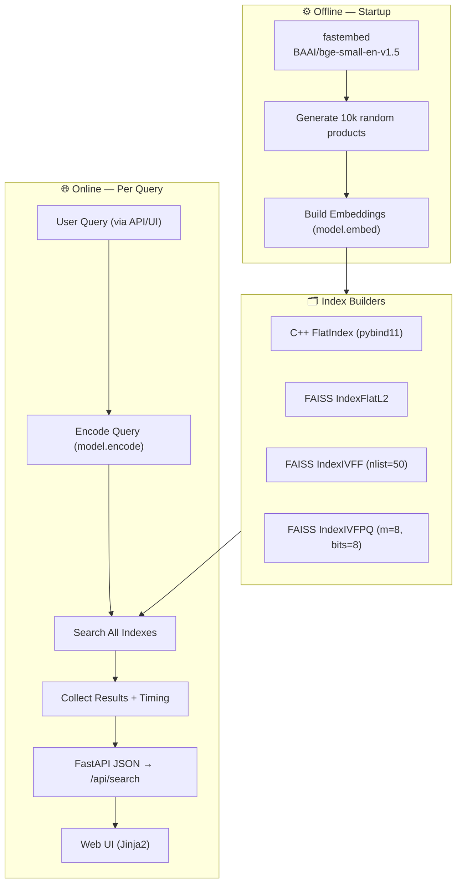
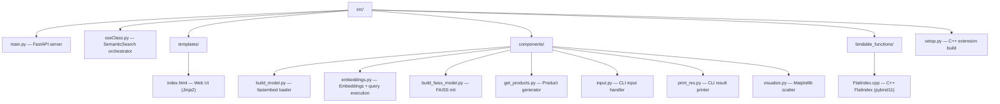
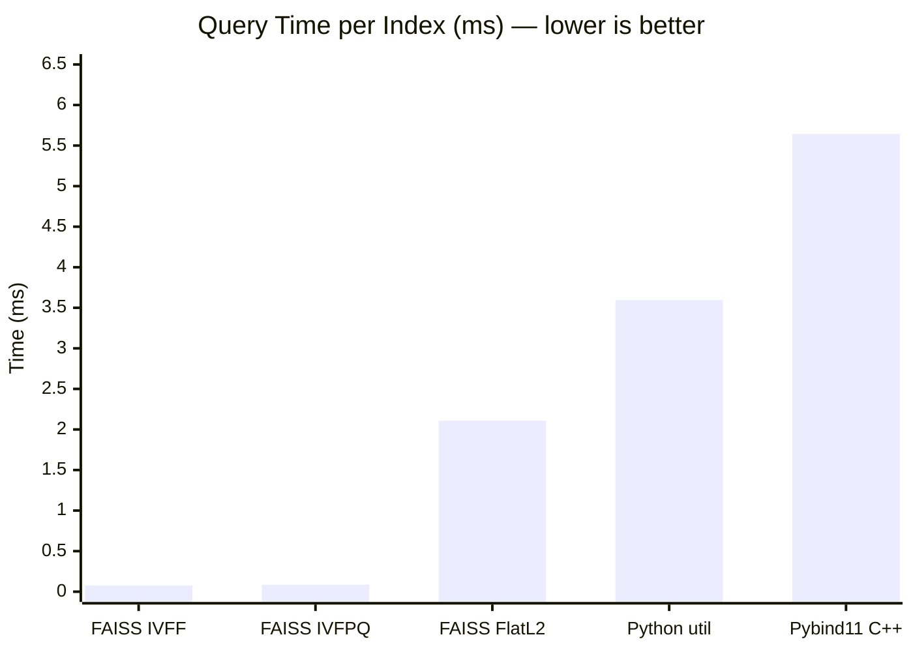

# SSE Benchmark -- Semantic Search Engine

A semantic search engine that benchmarks multiple indexing strategies against one another -- from a custom C++ FlatIndex to FAISS IVF indexes -- all served through a FastAPI web UI.

---

## Pipeline



---

## Features

- **5 search strategies** compared per query -- C++ FlatIndex, FAISS FlatL2, FAISS IVFF, FAISS IVFPQ, and Python cosine similarity
- **Web UI** with side-by-side result comparison and ranked timing breakdown
- **REST API** -- single endpoint, structured JSON responses
- **Benchmarking built-in** -- every query measures and reports timing for each index
- **10k product catalog** -- random synthetic data (8 categories x 8 product types x model numbers)

---

## Architecture



### Indexes

| Index | Type | Training | Speed | Accuracy |
|-------|------|----------|-------|----------|
| Python util.cos_sim | Flat (brute-force) | None | *** | Exact |
| C++ FlatIndex | Flat (brute-force) | None | *** | Exact |
| FAISS FlatL2 | Flat (L2 distance) | None | *** | Exact |
| FAISS IVFF | IVF (50 Voronoi cells) | Required | ***** | ~99% |
| FAISS IVFPQ | IVF + PQ (8 sub-vectors) | Required | ****** | ~97% |

---

## Quick Start

```bash
# Install dependencies
pip install -r requirements.txt

# Build the C++ extension
pip install -e .

# Start the server
cd src
uvicorn main:app --reload
```

Open [http://localhost:8000](http://localhost:8000) -- the search engine loads automatically (model download + index building takes ~10-30s on first run).

### API

```bash
curl -X POST http://localhost:8000/api/search \
  -H "Content-Type: application/json" \
  -d '{"query": "wireless headphones"}'
```

Returns:

```json
{
  "query": "wireless headphones",
  "indexes": {
    "ivfpq": {
      "label": "FAISS IVFPQ",
      "results": [
        {"rank": 1, "product": "Wireless Headphones model 42", "score": 0.8523}
      ]
    },
    "ivff": {
      "label": "FAISS IVFF",
      "results": [
        {"rank": 1, "product": "Wireless Headphones model 42", "score": 0.8511}
      ]
    }
  },
  "timing": [
    "FAISS IVFPQ: 0.987ms",
    "FAISS IVFF: 1.234ms",
    "FAISS FlatIndexL2: 3.456ms",
    "Similarity (Pybind11 + C++): 5.678ms",
    "Similarity (util python library): 15.234ms"
  ]
}
```

> Timing entries are returned in the order they are measured by the engine and **sorted fastest -> slowest in the UI**.

---

## Benchmark Results

**Query:** "heavy-duty keyboard" -- 10k product corpus.

### FAISS IVFPQ (top 10)

| Rank | Product                        | Distance |
| ---: | ------------------------------ | -------: |
|    1 | Heavy-duty Keyboard model 4903 |   0.2227 |
|    2 | Heavy-duty Keyboard model 8153 |   0.2307 |
|    3 | Heavy-duty Keyboard model 1235 |   0.2322 |
|    4 | Heavy-duty Keyboard model 2515 |   0.2377 |
|    5 | Heavy-duty Keyboard model 2689 |   0.2386 |
|    6 | Heavy-duty Keyboard model 5587 |   0.2393 |
|    7 | Heavy-duty Keyboard model 2943 |   0.2395 |
|    8 | Heavy-duty Keyboard model 2106 |   0.2443 |
|    9 | Heavy-duty Keyboard model 2139 |   0.2447 |
|   10 | Heavy-duty Keyboard model 657  |   0.2453 |

### FAISS IVFF (top 10)

| Rank | Product                        | Distance |
| ---: | ------------------------------ | -------: |
|    1 | Heavy-duty Keyboard model 6593 |   0.2408 |
|    2 | Heavy-duty Keyboard model 6569 |   0.2427 |
|    3 | Heavy-duty Keyboard model 7529 |   0.2531 |
|    4 | Heavy-duty Keyboard model 5587 |   0.2578 |
|    5 | Heavy-duty Keyboard model 1235 |   0.2617 |
|    6 | Heavy-duty Keyboard model 7129 |   0.2665 |
|    7 | Heavy-duty Keyboard model 5274 |   0.2676 |
|    8 | Heavy-duty Keyboard model 150  |   0.2681 |
|    9 | Heavy-duty Keyboard model 9374 |   0.2687 |
|   10 | Heavy-duty Keyboard model 4913 |   0.2713 |

### Timing comparison (ranked by speed)

| Stage                            | Time (ms) |
| -------------------------------- | --------: |
| FAISS IVFF                       |     0.076 |
| FAISS IVFPQ                      |     0.086 |
| FAISS FlatIndexL2                |     2.108 |
| Similarity (util python library) |     3.594 |
| Similarity (Pybind11 + C++)      |     5.644 |



---

## License

MIT